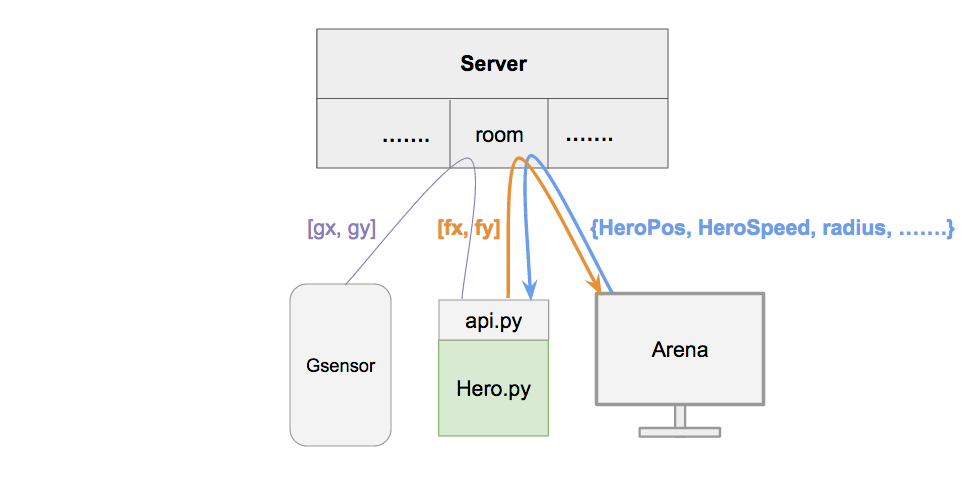

# SNP 期末專題 - Ballfight

  
遊戲有三個元件：
- [競技場](http://snp2016.nctu.me/)：請用電腦瀏覽器打開，為遊戲進行的場所
- hero.py：控制競技場中的英雄，讓他在遊戲中獲勝
    - [在 windows 上](install/ballfight-windows.md)
    - [在 mac 上](install/ballfight-mac.md)
    - [在 ubuntu 上](install/ballfight-ubuntu.md)
    - [在 c9 上](install/ballfight-c9.md)
- [手機重力感應器](http://snp2016.nctu.me/gsensor.html)：這個為非必要的元件。若你想要用手機協助競技場中的英雄，請用手機瀏覽器開啟該網頁，該網頁會把手機的重力資訊傳給 _hero.py_，讓你可以利用收到的重力感應器資訊做決策。


有任何問題請用力地把信寄給 `s2821d3721@gmail.com`


## 勝負條件
- 競技場(黑色範圍)含有英雄(綠球)與怪物(紅球)
- 當有一方整顆球超出競技場外遊戲結束
- 當遊戲結束時，綠球沒在界外即算綠球獲勝


## 遊戲規則
- 雙方能做的的操作只有對自己的球施予 `[fx, fy]` 的力
- 球的移動會受到與速度方向相反的摩差力影響
- 施力最大為 `1000`，超過的話以 `1000` 算
- 初始競技場半徑為 `350`，且會漸漸縮小
- 雙方球的半徑皆為 `25`
- 競技場的圓心為座標系統 `(0, 0)`，右邊為 x 軸正向，下方為 y 軸正向
- 英雄(綠球)初始位置 `(0, 250)`
- 怪物(紅球)初始位置 `(0, -250)`


## 架構圖
  
手機，競技場，hero 都會加入伺服器的某個 room。  
- 紫色資料流：手機重力感應器的資訊透過伺服器傳給 hero
- 藍色資料流：瀏覽器裡的競技場與怪物更新了場面狀態，透過伺服器傳給 hero
- 橘色資料流：你實作的 hero.py 利用我們提供的 api 取得各種資訊後，以此算出你想要的施力，再透過 api 將施力大小透過伺服器傳給競技場

_FYI_：一個 room 在手機，競技場，hero 進行遊戲時，伺服器的網路負擔約為進出各 5KB/s


## 開始吧！


### 英雄
打開 _hero.py_
```python
import api


def strategy():
    state = api.getState()
    myPos = api.getMyPosition()
    mySpeed = api.getMySpeed()
    enemyPos = api.getEnemyPosition()
    enemySpeed = api.getEnemySpeed()
    arenaR = api.getArenaRadius()
    gsensor = api.getGsensor()

    if state!='':
        # Win or lose
        print(state)

    return [-100, -100]


api.play('ws://snp2016.nctu.me:8080/ws', 'yourname', strategy)
```
你可以 `import` 所有你需要用到的套件，此外一定要 `import api` 已取得場面資訊與設定連線。  
在函數 `strategy` 裡面實作你的策略。此函數當場面_狀態改變_時被呼叫。以下任一條件皆會造成_狀態改變_：  
- 遊戲結束變進行中或反之
- 遊戲進行中，任何場面資訊的更新

在函數 `strategy` 裡面取得最新的場面資訊並以此下決策。上面的範例 code 已把所有可以取得的場面資訊幫你存在變數裡了，說明如下：  
- api.getState()：空字串代表遊戲進行中，否則回傳 `win` 或 `lose` 代表 hero 的輸贏
- api.getMyPosition()：`[x, y]` 代表你的位置
- api.getMySpeed()：`[vx, vy]` 代表你的速度
- api.getEnemyPosition()：`[x, y]` 代表敵人的位置
- api.getEnemySpeed()：`[vx, vy]` 代表敵人的速度
- api.getArenaRadius()：一個浮點數代表半徑
- api.getGsensor()：`[gx, gy]` 代表手機重力感應器的資訊


連線：  
`api.play('ws://snp2016.nctu.me:8080/ws', 'yourname', strategy)`  
- 第一個參數 `ws://snp2016.nctu.me:8080/ws` 代表伺服器 url
- 第二個參數 `yourname` 代表對戰的 room
- 第三個參數 `strategy` 為上面實作的遊戲策略
- 不同伺服器或不同 room 的遊戲不會相互影響到
- __注意__ 此行以下的程式碼將不會被執行


在黑盒子(terminal)進入 _hero.py_ 所在資料夾，執行 `python3 hero.py` 以執行 hero。


### 競技場
到此為止已實作好英雄的程式，接者打開瀏覽器連上[競技場](http://snp2016.nctu.me/)  
連上後 _Connection setting_ 的部分請填上英雄一樣的伺服器與 room： 
- url：已預設填上 TA 伺服器的 url，可以不用動這邊
- room：請填上剛剛英雄進去的 room


按下 _Submit_ 後將與伺服器進行連線，連線成功後有幾種遊戲模式可以選擇：
- Loser
- Softer
- Brownian
- Rusher
- CenterCamper
- PVP


### 手機重力感應器
若想要使用手機的重力感應器，請連上[此](http://snp2016.nctu.me/gsensor.html)。設定同上。  
平常請按左邊的 _hero_ 按鈕。只有當 PVP 時，扮演 monster 的那方需按下右邊的 _monster_ 按鈕以將資料改傳給 monster。  
若沒有連上的話 `api.getGsensor()` 的結果將為 `[0, 0]`。  
> 因為瀏覽器讀取重力感應器的功能尚不是廣泛支援。若連線後，手機重力感應器的資訊總是為 0，請換個瀏覽器或手機平台試試  


## PVP
可讓一支程式扮演 monster 相互對戰。  
1. api 的使用方式同單人遊戲。  
2. 寫好 monster 的 `strategy`  
3. monster 的 `api.play` 改成 `api.playMonster` 參數同 `hero.py`  
4. 在競技場選擇 `PVP` 模式  


## AI Trainer
若你想要訓練你的 AI 玩這個遊戲：  
- 聯絡 TA `s2821d3721@gmail.com` 協助你私架此遊戲的伺服器
